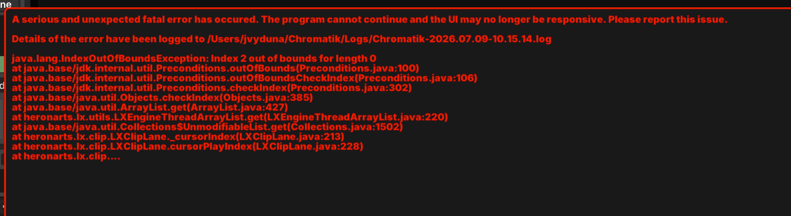
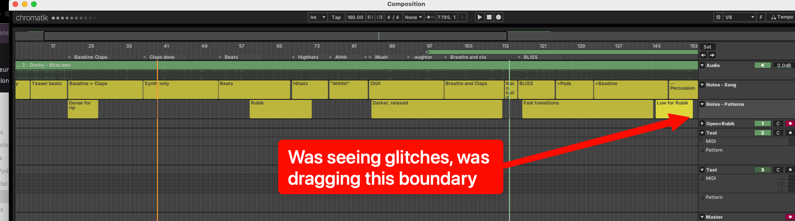

# Bug report: fatal UI-thread crash drawing a notes lane during a concurrent event edit

**Branch:** `arrange` (LXStudio + LX + GLX, 1.2.2-SNAPSHOT, as of 2026-07-09)
**Reported by:** Jeff Vyduna · **Analysis:** read-only source investigation + live crash log
**Severity:** **fatal** — unhandled exception on the render thread takes down the whole UI.
**Relationship:** same lane and same code as
[`2026-07-08-textnote-unsorted-events.md`](2026-07-08-textnote-unsorted-events.md);
this is that report's "side note #2" (the `eventIterator` list/thread
inconsistency) escalating from *cosmetic* to *fatal*. Different symptom, so
filed separately.

## This actually happened (2026-07-09)

First serious crash in real composition work. Jeff was editing `2 - Bliss.lxp`
with **a second notes lane** ("Notes - Patterns", added since the last save) and
**dragging the right/end boundary of the last text note in that second lane**.
He first saw text labels overlapping and disappearing (the cosmetic
unsorted-events glitch), then — mid-drag — the app threw and died:

> A serious and unexpected fatal error has occurred. The program cannot continue
> and the UI may no longer be responsive.

**~20 minutes of composition work was lost** (last save at 10:51, crash at
13:30 — but the relevant second-lane work post-dated the save). See the note to
Mark at the bottom re: autosave/recovery, which is the real headline here.





## Log

`~/Chromatik/Logs/Chromatik-2026.07.09-10.15.14.log:181` (session opened 10:15,
crashed 13:30:06, window closed 13:37:55):

```
[LX 2026/07/09 13:30:06] UI THREAD FAILURE: Unhandled error in BGFXEngine.draw(): Index 2 out of bounds for length 0
java.lang.IndexOutOfBoundsException: Index 2 out of bounds for length 0
    at java.base/java.util.ArrayList.get(ArrayList.java:427)
    at heronarts.lx.utils.LXEngineThreadArrayList.get(LXEngineThreadArrayList.java:220)
    at java.base/java.util.Collections$UnmodifiableList.get(Collections.java:1502)
    at heronarts.lx.clip.LXClipLane._cursorIndex(LXClipLane.java:213)
    at heronarts.lx.clip.LXClipLane.cursorPlayIndex(LXClipLane.java:228)
    at heronarts.lx.clip.LXClipLane.eventIterator(LXClipLane.java:176)
    at heronarts.lx.studio.ui.composition.UITextNoteLane.onDraw(UITextNoteLane.java:87)
    at heronarts.glx.BGFXEngine.draw(BGFXEngine.java:266)
    ...
```

`UITextNoteLane.onDraw` runs on the GLX render thread; the exception is not
caught in the draw path (`BGFXEngine.draw` → `GLX.run`), so it is fatal rather
than a dropped frame.

## Root cause: the notes renderer binary-searches the LIVE engine list, not the UI snapshot it was handed

`LXClipLane` keeps two views of its events
(`LXClipLane.java:53-55`):

```java
protected final LXEngineThreadArrayList<T> mutableEvents = new LXEngineThreadArrayList<>();
public    final List<T>                    events        = Collections.unmodifiableList(this.mutableEvents);
```

`LXEngineThreadArrayList` is a CopyOnWrite-like structure: a single live
`engineList` (only the engine thread writes it) plus an on-demand immutable
**copy** for the UI thread (`getUIThreadList()`), swapped atomically
(`LXEngineThreadArrayList.java:44-46, 107-118`). The `events` field wraps the
list with `Collections.unmodifiableList`, but that wrapper only blocks
*structural writes* — its `get(i)` delegates straight through to the live
`engineList` (`LXEngineThreadArrayList.get`, line 220). **Reading `this.events`
from the UI thread reads the live, concurrently-mutated engine list.**

The renderer does the right thing at the call site and the wrong thing one frame
deeper:

```java
// UITextNoteLane.onDraw (UITextNoteLane.java:86-87) — CORRECT: grabs the safe snapshot
final List<TextNoteClipEvent> events = this.lane.getUIThreadEvents();     // immutable UI copy
ListIterator<TextNoteClipEvent> iter = this.lane.eventIterator(events, this.lens.toCursorFromViewPosition(), -1);
```

```java
// LXClipLane.eventIterator(List, Cursor, int) (LXClipLane.java:175-178) — BUG
public ListIterator<T> eventIterator(List<T> events, Cursor fromCursor, int offset) {
  int index = LXUtils.constrain(cursorPlayIndex(fromCursor) + offset, 0, events.size());
  //                            ^^^^^^^^^^^^^^^^^^^^^^^^^^^^ ignores `events`
  return events.listIterator(index);
}
```

```java
// LXClipLane.java:227-229 — the no-list overload searches the LIVE field
protected int cursorPlayIndex(Cursor cursor) {
  return _cursorIndex(this.events, cursor, true);   // <-- live engine list, not the passed snapshot
}
```

So the iterator is built over the immutable UI copy, but its **start index** is
computed by binary-searching the *live* `this.events`. `_cursorIndex`
(`LXClipLane.java:200-225`) reads `right = events.size() - 1`, computes
`mid`, then `events.get(mid)` (line 213).

## The race (matches Jeff's action exactly)

Dragging a note's end boundary commits an edit on the engine thread. Rewrites
that rebuild the lane go through `LXEngineThreadArrayList.set(List)`
(`LXClipLane.java:358, 564`), which is:

```java
public void set(List<T> contents) { begin(); clear(); addAll(contents); commit(); }
```

Between `clear()` and `addAll()` the live `engineList` is **length 0**. The
render thread, mid-`_cursorIndex`, had already read a non-empty `size()` and
computed `mid = 2`; the subsequent `engineList.get(2)` then hit the emptied list
→ `IndexOutOfBoundsException: Index 2 out of bounds for length 0` → unhandled in
`BGFXEngine.draw` → fatal. (A note whose event-time reordering produces a
`mutableEvents.set(...)` rebuild — which is exactly what dragging the *last*
note's boundary past/among neighbors does — is the trigger, tying this to the
unsorted-events lane and to the second lane Jeff had just added.)

Because `get()` reads the live list while `size()` may have been read a moment
earlier (or from the UI copy), a `set()`/rebuild anywhere in the drag window can
tear. It is a genuine data race, not just an ordering issue — the unmodifiable
wrapper gives no snapshot isolation.

## Suggested fix

**Primary (one line).** The list-aware overload already exists
(`cursorPlayIndex(List<T> events, Cursor cursor)`, `LXClipLane.java:235-237`).
Have `eventIterator` use the snapshot it was handed:

```java
// LXClipLane.java:176
int index = LXUtils.constrain(cursorPlayIndex(events, fromCursor) + offset, 0, events.size());
```

Now the binary search and the iteration both run over the same immutable
`getUIThreadEvents()` copy — no live-list reads from the render thread, no tear.
(Audit the other no-list `cursorPlayIndex`/`cursorInsertIndex` callers reached
from UI-thread draw/hit-test code for the same substitution — e.g. the
`getEventAtMouse` / selection paths noted in the unsorted-events report.)

**Defense in depth (recommended regardless).** The render thread should never be
able to kill the app. Wrap the per-lane `onDraw` body (or the draw dispatch in
`BGFXEngine.draw`) so an exception drops the frame and logs, rather than
propagating out of the GLX main loop. A transient index tear should cost one
frame, not the whole session's unsaved work.

**Correctness-adjacent.** Fixing the unsorted-events append bug (the sibling
report) also removes one of the ways a boundary drag ends up rewriting the whole
lane via `set()`, shrinking the race window — but the thread-safety fix above is
the real cure and stands on its own.

## Note to Mark — the missing safety net matters more than this one bug

Only ~20 minutes were lost this time, but that number understates the risk, and
the reason is counterintuitive:

**Chromatik is so stable that it trains users not to save.** With crash-prone
tools you save constantly out of fear; with a rock-solid one you don't think
about it for hours. So the *rare* crash in stable software tends to land on a
much larger pile of accumulated unsaved edits than the *frequent* crash in flaky
software ever does. Low crash rate + no recovery net = occasionally catastrophic
loss. A crash-recovery feature is arguably *more* valuable in stable software,
not less.

Two other very crash-prone tools I use handle this in two different ways:

- **Blackmagic Fusion — silent timed autosave + recovery prompt on relaunch
  (preferred).** Fusion quietly autosaves every ~5 minutes to a hidden location.
  After a crash, on relaunch it greets me with *"We crashed — would you like to
  restore autosave data from X minutes ago?"* Choosing yes opens the autosave as
  a separate `<filename> (Recovered <timestamp>)` document, with a warning to
  only save it over my original once I'm confident the crash won't recur. Nothing
  accumulates on disk in normal use; the recovery copy is transient and
  user-confirmed.
- **Pangolin Beyond — timestamped backup copies that grow forever.** Beyond
  writes a second timestamped copy into a `./backups/` folder every time I save,
  *plus* autosaves there on a configurable interval (up to one hour). It works,
  but those directories grow without bound and get large — commonly 10–200 MB
  each — so users eventually have to cull them or the disk fills.

I strongly prefer Fusion's approach: **timed background autosave to a managed
(non-accumulating) location, plus a "restore from autosave?" prompt on the next
launch after an abnormal exit, restored as a clearly-labeled separate file.** It
gives the safety net without the disk-bloat cleanup burden Beyond pushes onto
the user. Even a minimal version — periodically write the in-memory project to a
sidecar (`<project>.autosave.lxp` or a temp dir) and offer to reopen it if the
last session didn't shut down cleanly — would have made this crash a non-event.
